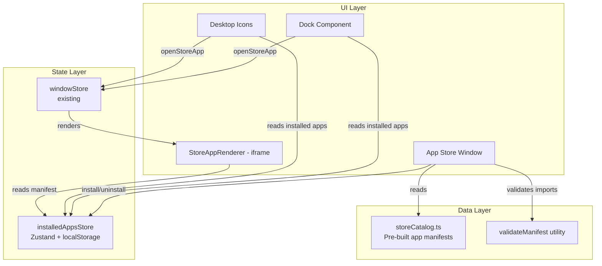

# Design Document: App Store

## Overview

The App Store feature extends Nebula OS with a dynamic application ecosystem. It introduces a catalog of installable apps, a Zustand-based persistence layer, and an iframe-based renderer — all integrated with the existing window management system.

The core challenge is bridging the static, compile-time app system (where `AppId` is a string literal union and registries are hardcoded maps) with a dynamic, runtime-installed app system. The design solves this by introducing a parallel "store app" concept that coexists with built-in apps rather than replacing the existing type system.

**Key design decisions:**

1. **Parallel app identity** — Store apps use a `StoreAppId` (arbitrary string) separate from the built-in `AppId` union type. This avoids modifying the existing type system while allowing dynamic apps.
2. **Unified launcher interface** — Dock and DesktopIcons consume both built-in and installed apps by merging static arrays with the installed apps store.
3. **Iframe sandbox** — Store apps render in sandboxed iframes, providing security isolation without requiring trust in third-party code.
4. **localStorage persistence** — The `installedAppsStore` uses Zustand's `persist` middleware for automatic localStorage sync.

## Architecture



### Integration with Existing System

The existing system uses a closed `AppId` type and static registries. Rather than making `AppId` dynamic (which would break type safety across the codebase), the design introduces:

1. A new `openStoreApp(storeAppId)` action on `windowStore` that creates windows for store apps
2. A `StoreAppRenderer` component that the `WindowManager` uses when it detects a store app window
3. Modified `Dock` and `DesktopIcons` that merge their static arrays with installed apps from the store

## Components and Interfaces

### New Types (`src/types/index.ts` additions)

```typescript
// App manifest type discriminated union
export type AppManifestType = 'web' | 'html';

export interface AppManifestBase {
  id: string;           // Unique identifier (must not collide with AppId)
  name: string;         // Display name
  icon: string;         // Emoji string
  description: string;  // Short description
}

export interface WebAppManifest extends AppManifestBase {
  type: 'web';
  url: string;          // URL to load in iframe
}

export interface HtmlAppManifest extends AppManifestBase {
  type: 'html';
  html: string;         // Inline HTML/CSS/JS content
}

export type AppManifest = WebAppManifest | HtmlAppManifest;

// Store app window state extends the concept
export interface StoreAppWindowState {
  id: string;           // Window instance ID
  storeAppId: string;   // References AppManifest.id
  title: string;
  position: Position;
  size: Size;
  zIndex: number;
  isMinimized: boolean;
  isMaximized: boolean;
  previousBounds?: { position: Position; size: Size };
}
```

### installedAppsStore (`src/stores/installedAppsStore.ts`)

```typescript
export interface InstalledAppsStore {
  installedApps: AppManifest[];
  installApp: (manifest: AppManifest) => void;
  uninstallApp: (appId: string) => void;
  getInstalledApp: (appId: string) => AppManifest | undefined;
  isInstalled: (appId: string) => boolean;
}
```

Uses Zustand `persist` middleware with `localStorage` key `"nebula-installed-apps"`. On hydration failure (corrupted data), falls back to empty array and logs a console warning.

### windowStore Extensions

Add to the existing `windowStore`:

```typescript
// New state
storeAppWindows: StoreAppWindowState[];

// New actions
openStoreApp: (storeAppId: string) => void;
closeStoreAppWindow: (windowId: string) => void;
closeStoreAppWindowsByAppId: (storeAppId: string) => void;
```

`openStoreApp` looks up the manifest from `installedAppsStore`, creates a `StoreAppWindowState`, and adds it to `storeAppWindows`. This keeps store app windows separate from built-in windows in state while the `WindowManager` renders both.

### Manifest Validator (`src/utils/validateManifest.ts`)

```typescript
export interface ValidationResult {
  valid: boolean;
  errors: string[];
}

export function validateManifest(input: unknown): ValidationResult;
```

Validates:
- Required fields present: `id`, `name`, `icon`, `description`, `type`
- `type` is `"web"` or `"html"`
- If `type === "web"`: `url` field is a non-empty string
- If `type === "html"`: `html` field is a non-empty string
- `id` does not collide with built-in `AppId` values
- `id` is a non-empty string matching `/^[a-z0-9-]+$/`

Returns a `ValidationResult` with all errors collected (not fail-fast).

### StoreAppRenderer (`src/components/StoreAppRenderer.tsx`)

```typescript
interface StoreAppRendererProps {
  manifest: AppManifest;
}
```

Renders an iframe that fills the window content area:
- For `type: "web"`: sets `src={manifest.url}`
- For `type: "html"`: sets `srcDoc={manifest.html}`
- Always applies `sandbox="allow-scripts"` attribute
- Shows a fallback error UI if the iframe fails to load (via `onError` handler)

### AppStore Window (`src/apps/AppStore.tsx`)

The App Store UI with three sections:
1. **Catalog Grid** — displays all catalog apps with install/uninstall buttons
2. **Installed Apps** — shows currently installed apps with uninstall option
3. **Custom Import** — textarea for JSON paste + file upload for `.nebula` files

### Store Catalog (`src/data/storeCatalog.ts`)

Static array of `AppManifest` objects for the 6 pre-built apps:
- Calculator (html)
- Clock (html)
- Weather Widget (html)
- Paint App (html)
- Snake Game (html)
- Pomodoro Timer (html)

### Modified Components

**Dock** — merges `DOCK_APPS` with installed apps from `useInstalledAppsStore`. Adds an "App Store" entry to the static list. Installed apps appear after built-in apps.

**DesktopIcons** — merges `DESKTOP_ICONS` with installed apps. Adds an "App Store" icon. Installed apps appear after built-in icons.

**WindowManager** — detects `StoreAppWindowState` entries and renders them using `StoreAppRenderer` instead of `AppRenderer`.

## Data Models

### AppManifest Schema

| Field       | Type                | Required | Constraints                              |
|-------------|---------------------|----------|------------------------------------------|
| id          | string              | Yes      | `/^[a-z0-9-]+$/`, unique, no built-in collision |
| name        | string              | Yes      | Non-empty, max 50 chars                  |
| icon        | string              | Yes      | Non-empty (emoji)                        |
| description | string              | Yes      | Non-empty, max 200 chars                 |
| type        | `"web"` \| `"html"` | Yes      | Discriminator                            |
| url         | string              | web only | Valid URL string                         |
| html        | string              | html only| Non-empty HTML content                   |

### localStorage Schema

Key: `"nebula-installed-apps"`

```json
{
  "state": {
    "installedApps": [
      {
        "id": "calculator",
        "name": "Calculator",
        "icon": "🧮",
        "description": "A simple calculator",
        "type": "html",
        "html": "..."
      }
    ]
  },
  "version": 0
}
```

This follows Zustand's `persist` middleware format. The `version` field enables future migrations.

### Store App Window State

Store app windows live in `windowStore.storeAppWindows[]` alongside the existing `windows[]` array. The `WindowManager` iterates both arrays to render all windows. Store app windows use the same `Position`, `Size`, and z-index system as built-in windows.

Default size for store app windows: `{ width: 600, height: 450 }`.

