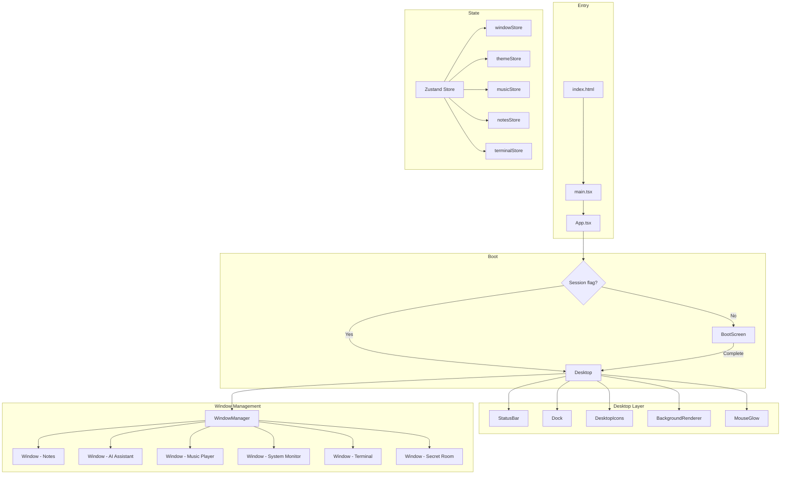
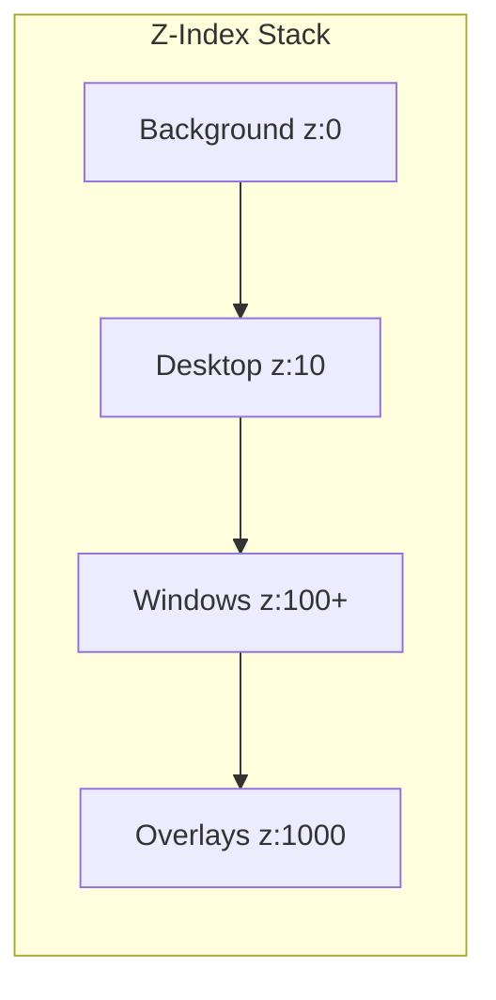

# Design Document — Nebula OS

## Overview

Nebula OS is a browser-based operating system experience built with React, Vite, and TailwindCSS. It delivers a cinematic cyberpunk desktop environment featuring draggable windows, five interactive applications, animated backgrounds, and hidden easter eggs — all optimized for GPU-accelerated rendering at 30fps+.

The system is structured as a single-page application (SPA) with a layered architecture:

1. **Background Layer** — Animated nebula/galaxy effect using CSS transforms and opacity
2. **Desktop Layer** — Status bar, dock, desktop icons, and widgets
3. **Window Layer** — Draggable, resizable application windows managed by a z-index stack
4. **Overlay Layer** — Boot sequence, matrix rain, and modal effects

### Key Design Decisions

| Decision | Choice | Rationale |
|----------|--------|-----------|
| State management | Zustand | Lightweight, minimal re-renders, no prop drilling |
| Window dragging/resizing | react-rnd | Battle-tested library for drag + resize with constraints |
| Animations | Framer Motion + CSS | Framer for orchestrated sequences, CSS for continuous loops |
| Styling | TailwindCSS | Utility-first, consistent design tokens, small bundle |
| Code splitting | React.lazy + Suspense | Per-app lazy loading for fast initial paint |
| Persistence | localStorage | Notes, preferences, session state — no backend needed |
| Audio | Web Audio API + HTML5 Audio | Frequency data for visualizer, standard playback for tracks |

## Architecture



### Layering Model



- **z:0** — BackgroundRenderer (particles, blobs, gradient animation)
- **z:10** — Desktop (icons, widgets, dock, status bar)
- **z:100+** — Windows (each window gets an incrementing z-index on focus)
- **z:1000** — Overlays (boot screen, matrix rain, modals)

## Components and Interfaces

### Core Components

#### App (`App.tsx`)
Root component. Checks sessionStorage for boot flag, renders BootScreen or Desktop.

#### BootScreen
- Displays sequential messages with configurable delays
- Animated progress bar (CSS width transition on transform-based bar)
- Glitch transition effect on completion
- Sets sessionStorage flag on complete
- Error boundary: skips to Desktop on asset failure

#### Desktop
- Layout container for StatusBar, Dock, DesktopIcons, BackgroundRenderer, MouseGlow
- Renders WindowManager for all open windows

#### StatusBar
- Real-time clock (HH:MM:SS) updated via `setInterval(1000)`
- Current date in "weekday, month day" format
- System indicators (theme name, active app count)

#### Dock
- Vertical panel (left side, ≥1024px) or bottom bar (<1024px)
- Application launcher icons with magnetic hover effect
- Minimized window indicators
- Click handler: opens app or brings existing window to foreground

#### WindowManager
- Manages window stack (z-index ordering)
- Provides window lifecycle: open, close, minimize, maximize, restore
- Constrains window position (50px title bar always visible)
- Uses react-rnd for drag and resize

#### BackgroundRenderer
- 3 semi-transparent blob elements with CSS keyframe animations (translate + scale)
- Up to 50 particle elements (small dots with opacity animation)
- Pauses on `visibilitychange` hidden, resumes on visible
- All elements use `pointer-events: none`

#### MouseGlow
- Tracks cursor position via `mousemove` event
- Renders radial gradient (≤300px radius, ≤15% opacity)
- Uses `transform: translate()` for positioning

### Application Components (Lazy-loaded)

#### NotesApp
- Sidebar: note list grouped by category, title (first 50 chars), last-modified
- Editor: textarea with onChange debounce (2s) → localStorage save
- Preview: markdown rendered via a lightweight parser (e.g., marked or react-markdown)
- Category assignment on note creation
- Max 100,000 characters per note

#### AIAssistant
- Chat interface with message bubbles (user right, assistant left)
- Typing animation (500ms–2000ms) before response display
- Command recognition: maps keywords to system actions
- Predefined response map for greetings, help, about, commands
- Fallback response for unrecognized queries
- Glowing border animation (CSS box-shadow cycle)

#### MusicPlayer
- Playlist of ≥3 lofi/ambient tracks (bundled or CDN-hosted)
- Play/pause with vinyl rotation animation
- Waveform visualizer using Web Audio API AnalyserNode (30fps+ canvas draw)
- Next/previous with playlist wrapping
- Volume slider (0–100%) with immediate audio gain update
- Continues playback when minimized (audio element persists outside window DOM)

#### SystemMonitor
- CPU/RAM graphs: circular buffer of 30 data points, updated every 2s
- Simulated values: random walk within 0–100% range
- Neon-styled SVG line graphs with animated path transitions
- Real-time clock (24h format, updated every 1s)
- Weather display: fetches from a free API (OpenWeatherMap) or shows fallback

#### Terminal
- Command input with history (up/down arrow navigation)
- Command registry: help, projects, about, music, clear, notes, ls, cd, matrix, hack, theme, secret
- Fake filesystem tree (3 directories, 5 files)
- Animated typing output (20–50 chars/sec via requestAnimationFrame)
- Case-insensitive command matching (`.toLowerCase()`)
- Easter eggs: matrix rain, hack sequence, secret room, theme switching

### Interfaces

```typescript
// Window state
interface WindowState {
  id: string;
  appId: AppId;
  title: string;
  position: { x: number; y: number };
  size: { width: number; height: number };
  zIndex: number;
  isMinimized: boolean;
  isMaximized: boolean;
  previousBounds?: { position: Position; size: Size };
}

// App registry
type AppId = 'notes' | 'ai-assistant' | 'music-player' | 'system-monitor' | 'terminal' | 'secret-room';

interface AppDefinition {
  id: AppId;
  title: string;
  icon: React.ComponentType;
  component: React.LazyExoticComponent<React.ComponentType>;
  defaultSize: { width: number; height: number };
}

// Window store (Zustand)
interface WindowStore {
  windows: WindowState[];
  activeWindowId: string | null;
  openWindow: (appId: AppId) => void;
  closeWindow: (id: string) => void;
  minimizeWindow: (id: string) => void;
  maximizeWindow: (id: string) => void;
  restoreWindow: (id: string) => void;
  focusWindow: (id: string) => void;
  updatePosition: (id: string, position: Position) => void;
  updateSize: (id: string, size: Size) => void;
}

// Theme store
interface ThemeStore {
  activeTheme: ThemeName;
  setTheme: (name: ThemeName) => void;
}

type ThemeName = 'cyberpunk' | 'matrix' | 'aurora';

interface Theme {
  name: ThemeName;
  colors: {
    primary: string;
    secondary: string;
    accent: string;
    background: string;
    surface: string;
    text: string;
  };
}

// Notes store
interface Note {
  id: string;
  content: string;
  category: string;
  createdAt: number;
  updatedAt: number;
}

interface NotesStore {
  notes: Note[];
  activeNoteId: string | null;
  addNote: (category?: string) => void;
  updateNote: (id: string, content: string) => void;
  deleteNote: (id: string) => void;
  setActiveNote: (id: string) => void;
  loadFromStorage: () => void;
  saveToStorage: () => void;
}

// Music store
interface Track {
  id: string;
  title: string;
  artist: string;
  src: string;
  albumArt?: string;
}

interface MusicStore {
  tracks: Track[];
  currentTrackIndex: number;
  isPlaying: boolean;
  volume: number;
  play: () => void;
  pause: () => void;
  next: () => void;
  previous: () => void;
  setVolume: (volume: number) => void;
}

// Terminal
interface FileSystemNode {
  name: string;
  type: 'file' | 'directory';
  children?: FileSystemNode[];
  content?: string;
}

interface TerminalStore {
  history: TerminalEntry[];
  currentPath: string[];
  executeCommand: (input: string) => void;
  clear: () => void;
}

interface TerminalEntry {
  id: string;
  type: 'input' | 'output' | 'error';
  content: string;
  timestamp: number;
}
```

## Data Models

### Persistence (localStorage)

| Key | Type | Description |
|-----|------|-------------|
| `nebula-notes` | `Note[]` | All saved notes |
| `nebula-theme` | `ThemeName` | Active theme preference |
| `nebula-music-volume` | `number` | Last volume setting |
| `nebula-weather-location` | `string` | Weather location preference |

### Session (sessionStorage)

| Key | Type | Description |
|-----|------|-------------|
| `nebula-booted` | `"true"` | Boot sequence completed flag |

### File System (In-memory)

```
/home/
  /projects/
    readme.md
    portfolio.json
  /documents/
    notes.txt
    todo.md
  /system/
    config.sys
```

### Theme Definitions

```typescript
const themes: Record<ThemeName, Theme> = {
  cyberpunk: {
    name: 'cyberpunk',
    colors: {
      primary: '#8B5CF6',    // purple
      secondary: '#06B6D4',  // cyan
      accent: '#EC4899',     // neon pink
      background: '#0a0a0f', // near-black
      surface: 'rgba(139, 92, 246, 0.15)', // glass
      text: '#e2e8f0',
    },
  },
  matrix: {
    name: 'matrix',
    colors: {
      primary: '#22c55e',
      secondary: '#16a34a',
      accent: '#4ade80',
      background: '#000000',
      surface: 'rgba(34, 197, 94, 0.1)',
      text: '#22c55e',
    },
  },
  aurora: {
    name: 'aurora',
    colors: {
      primary: '#6366f1',
      secondary: '#8b5cf6',
      accent: '#06b6d4',
      background: '#0f172a',
      surface: 'rgba(99, 102, 241, 0.12)',
      text: '#e2e8f0',
    },
  },
};
```

## Correctness Properties

*A property is a characteristic or behavior that should hold true across all valid executions of a system — essentially, a formal statement about what the system should do. Properties serve as the bridge between human-readable specifications and machine-verifiable correctness guarantees.*

### Property 1: Clock formatting produces valid time strings

*For any* valid JavaScript Date object, the `formatClock` function SHALL produce a string matching the pattern `HH:MM:SS` where HH is 00–23, MM is 00–59, and SS is 00–59, and the `formatDate` function SHALL produce a string matching the pattern "weekday, month day".

**Validates: Requirements 2.1, 8.3**

### Property 2: No duplicate windows for the same application

*For any* window store state where an application is already open, calling `openWindow` with that application's ID SHALL NOT increase the window count and SHALL set the existing window's z-index to the maximum.

**Validates: Requirements 2.5**

### Property 3: Particle count invariant

*For any* state of the BackgroundRenderer (regardless of animation frame, visibility changes, or elapsed time), the number of particle DOM elements SHALL never exceed 50.

**Validates: Requirements 3.3**

### Property 4: Minimum window size constraint

*For any* resize operation on a window with any initial size and any resize delta, the resulting window dimensions SHALL never be less than 200px width and 150px height.

**Validates: Requirements 4.2**

### Property 5: Maximize/restore round-trip preserves bounds

*For any* window with arbitrary position and size, maximizing and then restoring SHALL return the window to its original position and size (within floating-point tolerance).

**Validates: Requirements 4.4, 4.5**

### Property 6: Close removes window from state

*For any* window store state containing one or more windows, closing a window by ID SHALL remove exactly that window from the windows array, leaving all other windows unchanged.

**Validates: Requirements 4.6**

### Property 7: Focused window gets highest z-index

*For any* window store state with multiple windows, focusing a window (either by opening a new one or clicking an existing one) SHALL assign it a z-index strictly greater than all other windows in the state.

**Validates: Requirements 4.7, 4.8**

### Property 8: Window position constraint keeps title bar visible

*For any* window position, window width, and viewport dimensions, the position clamping function SHALL ensure that at least 50px of the window's title bar remains within the viewport boundaries.

**Validates: Requirements 4.9**

### Property 9: Notes save/load round-trip

*For any* array of valid Note objects (each with content ≤ 100,000 characters, a category string, and timestamps), saving to localStorage and then loading SHALL produce an equivalent array with all fields preserved. Notes created without an explicit category SHALL have category "Uncategorized".

**Validates: Requirements 5.3, 5.4**

### Property 10: Note title extraction

*For any* note content string, the extracted title SHALL equal the first 50 characters of the first line of the content (or the full first line if shorter than 50 characters).

**Validates: Requirements 5.5**

### Property 11: Delete removes note from store and storage

*For any* notes store state containing one or more notes, deleting a note by ID SHALL remove exactly that note from both the in-memory store and localStorage, leaving all other notes unchanged.

**Validates: Requirements 5.7**

### Property 12: Unrecognized input produces fallback response

*For any* input string that does not match a recognized command or predefined query, the AI Assistant SHALL return a non-empty fallback response suggesting available commands, and the Terminal SHALL return a message in the format "Command not found: [input]. Type 'help' for available commands."

**Validates: Requirements 6.4, 9.8**

### Property 13: Playlist index wrapping

*For any* playlist of length N (N ≥ 1) and any current track index, calling `next` when at index N-1 SHALL produce index 0, and calling `previous` when at index 0 SHALL produce index N-1.

**Validates: Requirements 7.4**

### Property 14: Volume clamping

*For any* numeric volume value (including values outside [0, 1]), the `setVolume` function SHALL clamp the stored volume to the range [0, 1] inclusive.

**Validates: Requirements 7.6**

### Property 15: Circular buffer invariant

*For any* sequence of numeric values pushed to the system monitor's data buffer, the buffer SHALL never contain more than 30 entries, and entries SHALL be in FIFO order (oldest first, newest last).

**Validates: Requirements 8.1, 8.2**

### Property 16: Terminal clear empties history

*For any* terminal state with any number of history entries, executing the "clear" command SHALL result in an empty history array.

**Validates: Requirements 9.5**

### Property 17: Filesystem navigation correctness

*For any* valid path in the fake filesystem tree, executing `cd [path]` SHALL update `currentPath` to that path, and executing `ls` SHALL return exactly the names of the children at the current path.

**Validates: Requirements 9.9**

### Property 18: Case-insensitive command matching

*For any* recognized command string and any arbitrary casing of that string (uppercase, lowercase, mixed), the Terminal SHALL produce the same output as the canonical lowercase version.

**Validates: Requirements 9.10**

### Property 19: Theme switching applies correct palette

*For any* valid theme name from the set {cyberpunk, matrix, aurora}, calling `setTheme` SHALL update the active theme and all color values SHALL match the predefined palette for that theme.

**Validates: Requirements 10.3**

### Property 20: Magnetic dock icon offset constraint

*For any* cursor position within 80px of a dock icon's center, the calculated icon offset SHALL be no greater than 6px in magnitude and SHALL be directed toward the cursor position.

**Validates: Requirements 12.6**

## Error Handling

### Boot Sequence Failures
- **Asset load failure**: Skip boot sequence entirely, render Desktop within 2 seconds
- **Implementation**: Error boundary around BootScreen catches any render/load error and sets `booted` flag

### Storage Failures
- **localStorage unavailable**: Display inline error toast in Notes app, retain content in editor state
- **Quota exceeded**: Same behavior — error message + content preserved in memory
- **Implementation**: Try/catch around all `localStorage.setItem` calls, surface error via store state

### Network Failures
- **Weather API failure**: Display "Weather unavailable" fallback with retry button
- **Font loading timeout (3s)**: CSS `font-display: swap` ensures text renders with system fallback immediately
- **Implementation**: AbortController with 3s timeout on weather fetch; `@font-face` with `font-display: swap`

### Audio Failures
- **Audio playback blocked**: Display "Click to enable audio" prompt (browser autoplay policy)
- **Track load failure**: Skip to next track automatically, show brief error indicator
- **Implementation**: Catch `play()` promise rejection, handle `error` event on audio element

### Feature Detection Failures
- **No backdrop-filter support**: Fall back to solid `rgba()` backgrounds without blur
- **Implementation**: CSS `@supports` query or `CSS.supports('backdrop-filter', 'blur(1px)')` check

### Window Management Edge Cases
- **Rapid open/close**: Debounce window operations, use unique IDs to prevent race conditions
- **Viewport resize while maximized**: Re-calculate maximized bounds on resize event

## Testing Strategy

### Unit Tests (Vitest + React Testing Library)

Focus on specific examples and edge cases:
- Boot sequence state transitions
- Individual command outputs (help, projects, about)
- Markdown rendering for specific inputs
- Responsive breakpoint rendering
- Error state displays (storage failure, network failure)
- Accessibility: keyboard navigation, ARIA labels

### Property-Based Tests (fast-check + Vitest)

Each correctness property maps to a property-based test with minimum 100 iterations:

| Property | Module Under Test | Generator Strategy |
|----------|-------------------|-------------------|
| 1: Clock formatting | `utils/formatTime.ts` | Arbitrary Date objects (random timestamps) |
| 2: No duplicate windows | `store/windowStore.ts` | Random window states + random AppId |
| 3: Particle count | `components/BackgroundRenderer` | Random animation states |
| 4: Min window size | `store/windowStore.ts` | Random sizes + random resize deltas |
| 5: Maximize/restore | `store/windowStore.ts` | Random position/size pairs |
| 6: Close removes window | `store/windowStore.ts` | Random window arrays + random ID |
| 7: Focus z-index | `store/windowStore.ts` | Random window arrays + random target |
| 8: Position constraint | `utils/clampPosition.ts` | Random positions + viewport sizes |
| 9: Notes round-trip | `store/notesStore.ts` | Random Note arrays (content ≤ 100k chars) |
| 10: Title extraction | `utils/extractTitle.ts` | Random multiline strings |
| 11: Delete note | `store/notesStore.ts` | Random Note arrays + random ID |
| 12: Fallback response | `utils/commandParser.ts` | Random non-command strings |
| 13: Playlist wrapping | `store/musicStore.ts` | Random playlist lengths + indices |
| 14: Volume clamping | `store/musicStore.ts` | Arbitrary floats (including negatives, >1) |
| 15: Circular buffer | `utils/circularBuffer.ts` | Random number sequences of varying length |
| 16: Terminal clear | `store/terminalStore.ts` | Random history arrays |
| 17: Filesystem nav | `utils/filesystem.ts` | Random valid paths from tree |
| 18: Case-insensitive | `utils/commandParser.ts` | Known commands with random casing |
| 19: Theme switching | `store/themeStore.ts` | Random valid theme names |
| 20: Dock magnetic offset | `utils/magneticEffect.ts` | Random cursor positions within 80px |

**Configuration:**
- Library: `fast-check` (TypeScript-native, integrates with Vitest)
- Iterations: 100 minimum per property
- Tag format: `// Feature: nebula-os, Property {N}: {title}`

### Integration Tests (Playwright)

- Full boot sequence → Desktop render flow
- Window drag/resize interactions
- Cross-app commands (terminal → music, terminal → notes)
- Responsive layout at 1024px, 768px, and 375px breakpoints
- Performance: FPS measurement during animations
- Lighthouse CI score ≥ 70

### Smoke Tests

- Application builds without errors
- All lazy-loaded chunks are generated
- CSS animations use only transform/opacity (lint rule)
- Backdrop-blur values ≤ 12px (lint rule)
- All 5 app icons render in Dock

